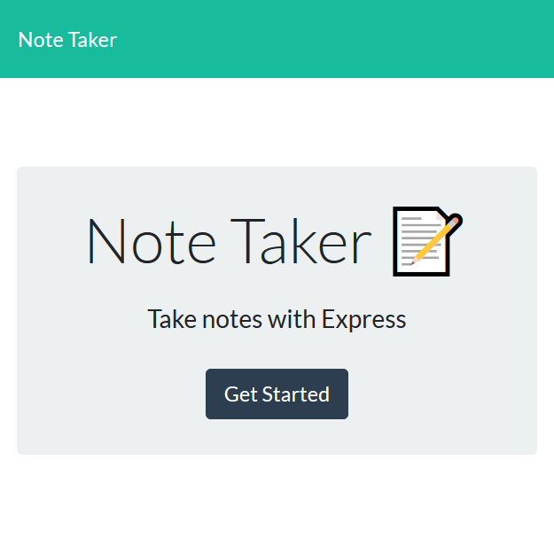

# Note Taker 
  
## Table of Contents
* [Installation](#Installation)
* [Usage](#Usage)
* [Credits](#Credits)
* [Contributing](#Contributing)
* [License](#License)
## Description
```
AS A user, I want to be able to write and save notes
I WANT to be able to delete notes I've written before
SO THAT I can organize my thoughts and keep track of tasks I need to complete
```

[](#)

## Installation
```npm i```
## Usage
```npm start```
## Credits
[ Daniel Vasquez Talavera](https://github.com/DVasquez4155)
## Contributing
This project has adopted the code of conduct defined by [Contributor Covenant](https://www.contributor-covenant.org/version/2/0/code_of_conduct/).
## License
Licensed under the [MIT License](https://choosealicense.com/licenses/mit/) license.